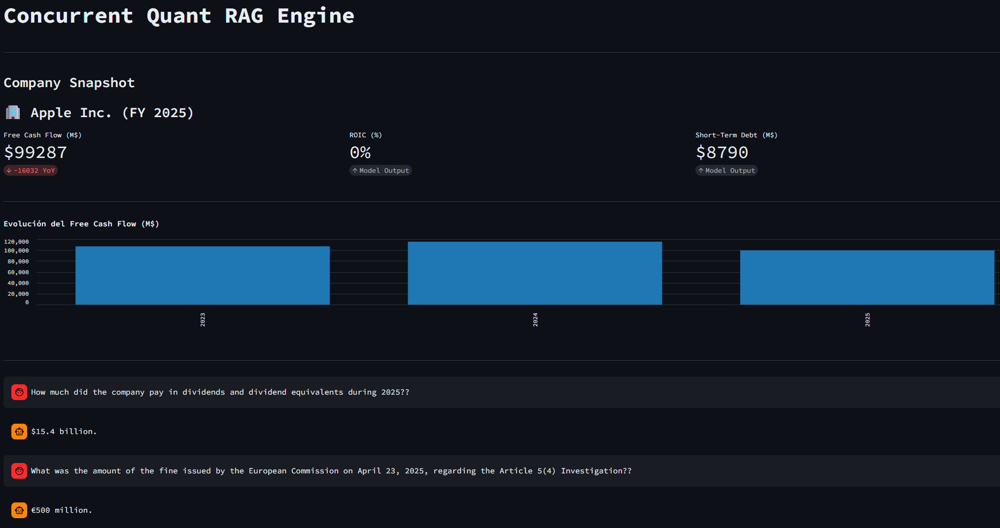

# Concurrent Quant RAG Engine

An asynchronous RAG engine built for quantitative extraction and semantic analysis of financial documents (e.g., SEC 10-K filings).

The core design goal was to eliminate LLM hallucinations and mathematical errors. 

## Technical Architecture

I built the pipeline around a two-phase context injection and asynchronous data flow to minimize latency and guarantee correct outputs:

* **Async Ingestion:** Document parsing, FAISS indexing, and local LLM inference run via `asyncio` and `aiohttp`. This keeps the Streamlit main thread completely unblocked during I/O operations.
* **Markdown Preservation:** The engine uses `pymupdf4llm` to parse PDFs directly into Markdown to preseve the integrity of tabular data
* **Two-Phase Context Injection:** Standard vector search fails at retrieving exact financial figures due to semantic blindness. The system extracts a structured JSON snapshot of key fundamentals first, caches it, and injects it directly into the LLM's prompt context. FAISS is left strictly for narrative queries.
* **Financial Math:** The model is forced to extract only raw accounting lines (e.g., Operating Cash Flow, Capital Expenditures). Python handles the actual FCF calculations and YoY deltas to ensure precision.

## Memory Management & Performance

* **State Integrity:** Streamlit's execution model redraws the UI constantly. The engine protects the FAISS index and the LLM JSON extraction using `st.session_state` caching, preventing redundant API calls and vector space contamination.
* **Fault Tolerance:** Output parsing relies on safe dictionary extraction (`.get()`) with default fallbacks. If the local model degrades its output or returns a malformed JSON due to token limits, the application catches the missing keys without crashing the main loop.

## Installation

1. **Clone the repository:**

    git clone https://github.com/AlePulSan/concurrent-quant-rag.git
    cd concurrent-quant-rag

2. **Install base dependencies:**

    pip install -r requirements.txt

3. **Local LLM Setup:**
Ensure you have Ollama running locally. Pull the default model:

    ollama pull llama3

## Usage

To deploy the engine and launch the concurrent UI:

    streamlit run app.py

## System Configuration

The engine parameters, including the local LLM endpoint and retrieval strictness, are isolated in `src/config.py`. Modify these constants to tune the pipeline:

    # Default model configuration
    DEFAULT_LLM_MODEL = "llama3"
    OLLAMA_URL = "http://localhost:11434/api/generate"

    # FAISS Retrieval configuration
    RETRIEVAL_K = 10